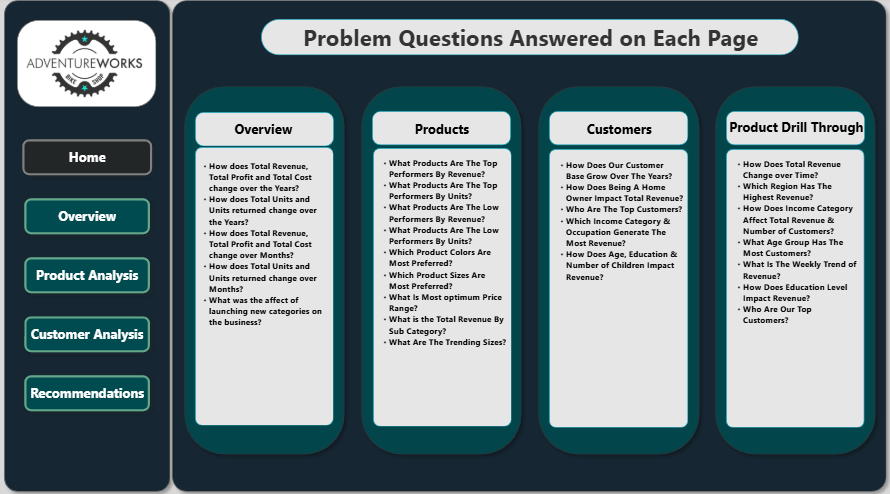
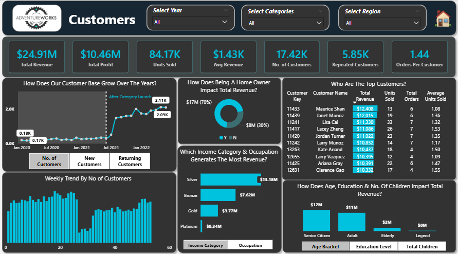
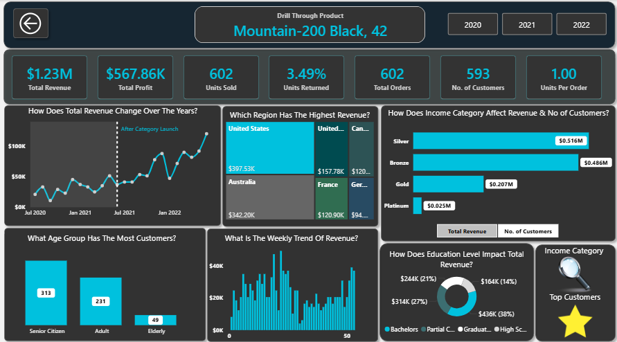
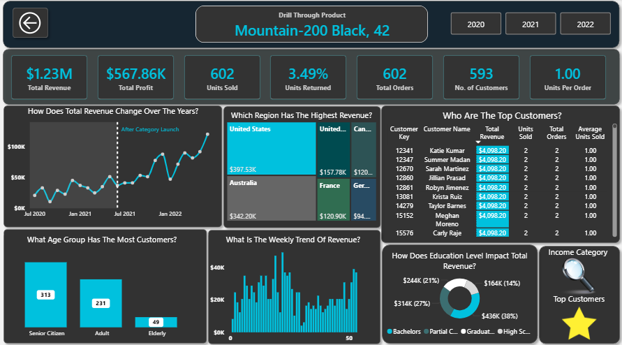
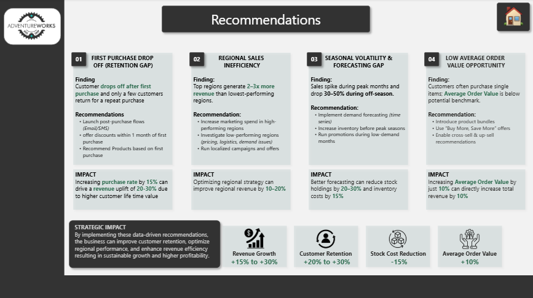

# 📊 Adventure Works Business Intelligence Dashboard

---

# 📌 Project Overview

This project features a comprehensive **Business Intelligence dashboard** for Adventure Works, a global manufacturing company. The report transforms raw transactional, product, and customer data into interactive visuals, allowing stakeholders to track KPIs, analyze regional performance, and identify trends in product returns and customer demographics.

---

# 📷 Dashboard Preview

*Interactive Power BI dashboard showcasing executive overviews, product performance, and customer insights.*

---

# 🎯 Objectives

* Track **Key Performance Indicators (KPIs)** including Revenue, Profit, and Total Orders.
* Analyze **Product Performance** across categories and sub-categories.
* Monitor **Return Rates** to identify quality control or satisfaction issues.
* Understand **Customer Demographics** and high-value geographic segments.
* Provide **AI-driven insights** for business growth and recommendations.

---

# 📂 Dataset Description

The analysis is based on the Adventure Works relational database, structured in a **Star Schema** for optimal performance:

* **Fact Tables:** Sales data (transactions) and Returns data.
* **Dimension Tables:** Products, Customers, Territories, and a dedicated Calendar table.
* **Data Volume:** Over 50,000+ records across multiple relational tables.

---

# 🔍 Key Insights

### 🛒 Executive Summary & Trends

* Monitoring revenue and profit trends over time to identify seasonal peaks and growth patterns.

📌 *Insight: Specific time periods show significant spikes in sales, suggesting high-impact seasonal promotions.*

---

### 📦 Product & Returns Analysis

* Detailed breakdown of revenue by product category (Bikes, Components, Clothing, Accessories).
* Identification of top-performing products and those with high return rates.

📌 *Insight: Certain sub-categories maintain high profitability despite lower total order volumes.*

---

### 👥 Customer Segmentation

* Analysis of customer income levels, occupation, and purchasing frequency.
* Identification of high-value customer profiles to help target marketing efforts.

📌 *Insight: Professional and Management occupations represent the highest lifetime value segments.*

---

### 🔬 Product Drill-Through

* Capability to drill into specific products to see individual performance metrics and historical trends.

---

### 💡 Recommendations

* Utilizing AI-driven visuals to identify key influencers and provide data-backed recommendations for business growth.

---

# 📉 Key KPIs (Dashboard Metrics)

* 💰 **Total Revenue:** Global sales performance across all categories.
* 📈 **Total Profit:** Net earnings after accounting for costs.
* 📦 **Total Orders:** Volume of transactions processed.
* 🔄 **Return Rate:** Percentage of products returned by customers.

---

# 📌 Conclusions

1. **Strategic Customer Targeting:** High-income earners in the **Professional and Management** occupations represent the most profitable segments. Marketing efforts should be tailored to these demographics to maximize Return on Investment (ROI).
2. **Product Return Optimization:** The analysis identifies specific sub-categories with disproportionately high return rates. Addressing these quality or description issues presents a significant opportunity to recover lost margins.
3. **Regional Market Strength:** North America and Australia remain the primary revenue drivers. However, specific territories within these regions show untapped potential for high-end bike sales based on customer density and income levels.
4. **Category Synergy:** While **Bikes** generate the highest revenue, the **Accessories** category drives the highest transaction volume. Using accessories as "entry products" can effectively build customer loyalty and lead to future high-value purchases.
5. **Data-Driven Growth:** Leveraging the interactive drill-through and AI influencer visuals allows management to move from reactive reporting to proactive strategy, identifying sales dips before they impact quarterly goals.

---

# 🛠️ Tools Used

* **Power BI Desktop:** Dashboard design and visualization.
* **Power Query:** ETL processes (Data cleaning and transformation).
* **DAX (Data Analysis Expressions):** Created complex measures for YoY growth and rolling averages.
* **Data Modeling:** Established relationships and a Star Schema architecture.

---

# 🧑‍💼 Author
**Muhammad Rohail** *Aspiring Data & Business Analyst* 
